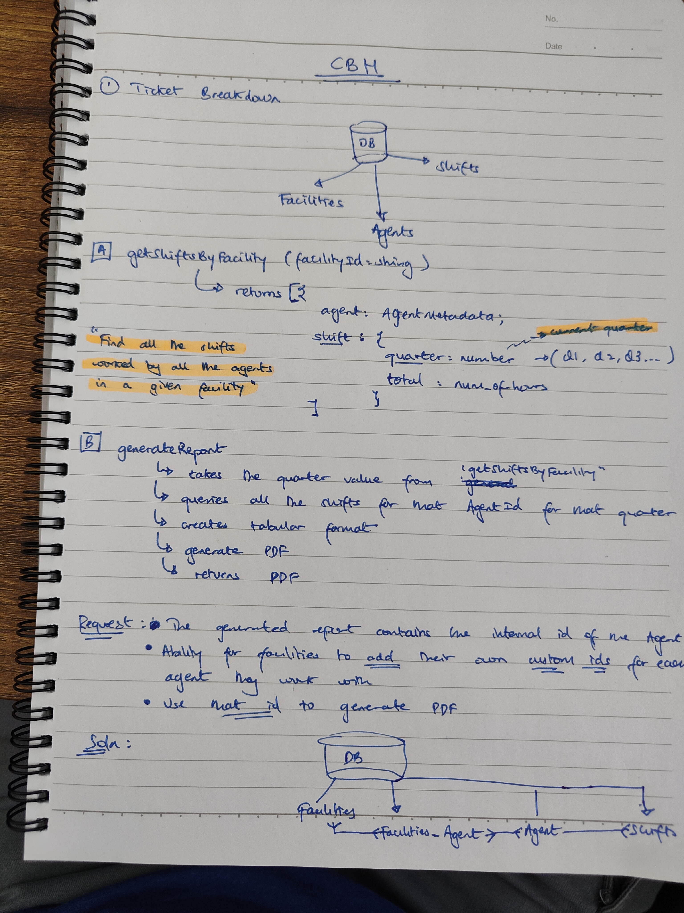

# Ticket Breakdown
We are a staffing company whose primary purpose is to book Agents at Shifts posted by Facilities on our platform.  
We're working on a new feature which will generate reports for our client Facilities containing info on how many hours each Agent worked in a given quarter  
by summing up every Shift they worked. Currently, this is how the process works:

- Data is saved in the database in the Facilities, Agents, and Shifts tables
- A function `getShiftsByFacility` is called with the Facility's id, returning all Shifts worked that quarter, including some metadata about the Agent assigned to each
- A function `generateReport` is then called with the list of Shifts. It converts them into a PDF which can be submitted by the Facility for compliance.

## You've been asked to work on a ticket. It reads:

**Currently, the id of each Agent on the reports we generate is their internal database id. We'd like to add the ability for Facilities to save their own custom ids for each Agent they work with and use that id when generating reports for them.**

Based on the information given, break this ticket down into 2-5 individual tickets to perform. Provide as much detail for each ticket as you can, including acceptance criteria, time/effort estimates, and implementation details. Feel free to make informed guesses about any unknown details - you can't guess "wrong".

You will be graded on the level of detail in each ticket, the clarity of the execution plan within and between tickets, and the intelligibility of your language. You don't need to be a native English speaker, but please proof-read your work.

## Your Breakdown Here

The below sketch describes what we will achieve in terms of architecture modification.  

#### Summary of Solution
We will create an intermediary table to hold references between the Facility's custom id and the Agent's internal id.  
From there, we will modify our API to allow for the Facility to pass in their custom id, and we will modify our report generation  
to use the custom id instead of the internal id.  The reasoning behind is:
* we want to preserve existing data
* we want to make this change as non-invasive as possible and respect our time+resource budget.  From experience, issues  
 can crop up when dealing with data migration, data integrity checks, and it is safer to enforce backwards compatibility  
 between API version.

I have a strong experience with mobile development in React Native, Databases on Mobile and this is how I would approach this problem.
Also, note that all unit tests are by default catering for both positive and negative scenarios.

##### Ticket 1: Create FacilityAgent table

Description:

    * Create a new intermediary table, FacilityAgent, to link the Facilities table with the Agents table. This table will  
    store a custom_id field for each Facility-Agent relationship.

Acceptance Criteria:

    * FacilityAgent table schema is created with facility_id, agent_id, and custom_id fields  
    * Write unit tests for the FacilityAgent model, schema, and CRUD operations on FacilityAgent table

Time/Effort Estimate: 3 hours

Implementation Details:

    * Create the database schema for FacilityAgent table with the following fields:
        # facility_id (foreign key referencing Facilities table)
        # agent_id (foreign key referencing Agents table)
        # custom_id (type: string, nullable)
    * Create FacilityAgent model
    * Create/Update migration script to include FacilityAgent table
    * Update database adapter to include new migration version

##### Ticket 2: Update API to support custom_id for Facility-Agent relationships

Description:

    * Modify the API to allow Facilities to create, update, and fetch Agent associations with their custom_id.

Acceptance Criteria:

    * API allows creating/updating Facility-Agent associations with custom_id
    * API response for fetching Facility-Agent associations includes custom_id
    * API for querying Facility-Agent by custom_id or facility_id or agent_id is created
    * Write unit tests on each API route to test the new functionality

Time/Effort Estimate: 4 hours

Implementation Details:

    * Update API routes for creating and updating Facility-Agent associations to accept custom_id in the request body
    * Update the model and controller logic to handle custom_id when creating and updating Facility-Agent associations
    * Update the API response for fetching Facility-Agent associations to include custom_id

##### Ticket 3: Update UI for Facilities to input custom_id for Agent associations

Description:

    * Update the user interface for Facilities to input custom_id when associating or editing an Agent.

Acceptance Criteria:

    * User Interface (UI) allows Facilities to input custom_id when associating or editing an Agent
    * UI displays custom_id in the list of Agent associations for each Facility
    * Write unit tests for the new UI component

Time/Effort Estimate: 4 hours

Implementation Details:

    * Add a new input field for custom_id in the Agent association/edit form in the UI
    * Update the form validation and submission logic to handle custom_id input
    * Update the Agent associations list view to display custom_id for each association

##### Ticket 4: Update getShiftsByFacility function to include custom_id

Description:

    * Modify the getShiftsByFacility function to include the custom_id of each Agent in the returned data.

Acceptance Criteria:

    * getShiftsByFacility function returns custom_id for each Agent in Shift data
    * Write unit tests for the new functionality

Time/Effort Estimate: 3 hours

Implementation Details:

    * Update the getShiftsByFacility function to join FacilityAgent table with custom_id
    * Include custom_id in the returned data for each Agent in Shifts as per the diagram above

##### Ticket 5: Update generateReport function to use custom_id

Description:

    Modify the generateReport function to use the custom_id of each Agent instead of their internal database ID when generating the report.

Acceptance Criteria:

    * Generated report displays custom_id for each Agent instead of their internal database ID
    * If custom_id is not available for an Agent, the report should display their internal database ID as a fallback
    * Write unit tests for the new functionality

Time/Effort Estimate: 4 hours

Implementation Details:

    * Update the generateReport function to replace Agent's internal database ID with custom_id in the report
    * Add a conditional check to use internal database ID as a fallback if custom_id is not available

##### Ticket 6: Refactor the whole app for new functionality
Description:

    *  Refactor the whole app to use the new functionality
    *  Ensure all unit test in the whole app are running successfully

Time/Effort Estimate: 2 days

Implementation Details:

    *  As described in the ticket description

##### Ticket 7: Train facilities to use new feature as part of a beta program

Description:

    * Handle edge cases that we've missed ( fallback to internal database ID, backward compatibility, etc)
    * Improve and fix bugs in the new functionality
    * Iterate on the new functionality to make it foolproof
    * Deploy the new functionality to the production environment

Time/Effort Estimate: 2 days

Implementation Details:

    * As described in the ticket description
